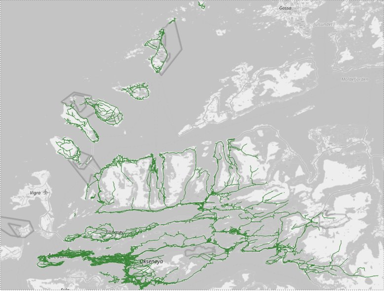

# Datasets

This folder contains the dataset used by the mobile and desktop applications.

The dataset was exported to two formats:

- *indicators.geojson*: contains the indicators in the [GeoJSON](https://geojson.org/) format.

- *osm-format*: contains the indicators in the [OSM](https://docs.fileformat.com/gis/osm/) format. The file *osm-format/nodes.xml* contains the coordinates of each node and the definition of each way. The other files (*osm-format/\*.csv*) contain the indicator values for each way.

The dataset contains indicator values for roads around the city of Ålesund, Norway:

The indicators consists of:

- Elevation: A place is considered more walkable if the elevation is low.
- Population density: A higher density means a more walkable area.
- Proximity of parks: This indicator is higher when a park is nearby.
- Street connectivity: The more street intersections, the better for walkability.
- Speed limit: It is safer to walk when the car speed limit is low.
- Pedestrian crossings: This indicator is higher when pedestrian crossings are nearby.
- Slope: A road with a high slope is less walkable.
- Distance to schools: This indicator is higher when schools are nearby.
- Distance to health facilities: This indicator is higher when health facilities such as hospitals or nursing home are nearby.
- Distance to lights: This indicator is higher when public lights are nearby.